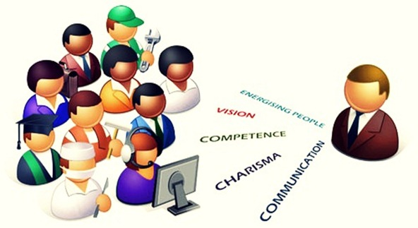
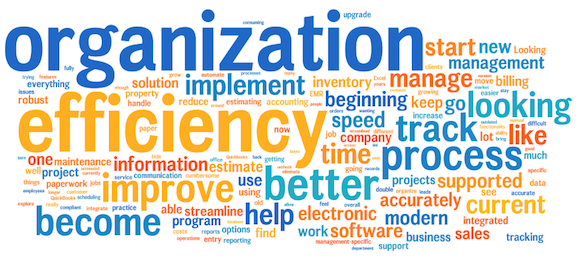
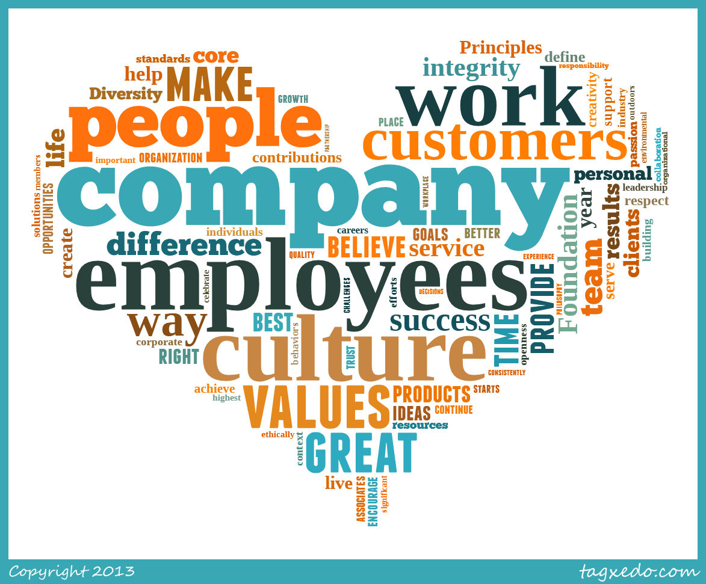
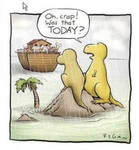

<!--  -->
<!-- <section data-background="figs/community.jpg"></section> -->
<section data-background="figs/Communication_bg.jpg"></section>
#  Why personal management skills important?
### presentation for LINK.
### Rong Bai

---

## Keywords?

---

<!-- <section data-background="figs/keywords.png"></section> -->

---

<!-- <section data-background="figs/keywords2.jpg"></section> -->

---

## Communications?

--

<!-- <section data-background="figs/communication.jpeg"></section> -->

---

## Efficiency?

--

<!-- <section data-background="figs/com_efficiency.jpeg"></section> -->

---

### Plan ahead?

---

## Deadline?

--

<!-- <section data-background="figs/Day26_missed_deadline.jpg"></section> -->

--

<!-- <section data-background="figs/deadline.jpg"></section> -->

---

## Thanks!

---
