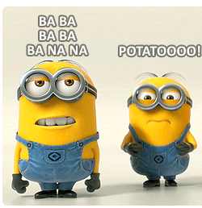
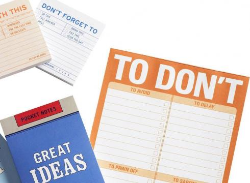
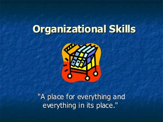

<!--  -->
<!-- <section data-background="figs/community.jpg"></section> -->
<section data-background="figs/Communication_bg.jpg"></section>
#  Why personal management skills important?
### presentation for LINK.
### Rong Bai

---

## Questions first day at work ?
#### What are the most important things at canadian workplace?

---

<!-- <section data-background="figs/keywords.png"></section> -->

---

<!-- <section data-background="figs/keywords2.jpg"></section> -->

---

## Personal management skills
  - Time management
  - Communication
  - Organizational skills

---

## Time Management
### Deadline?

---

<!-- <section data-background="figs/Day26_missed_deadline.jpg"></section> -->

---

<!-- <section data-background="figs/deadline.jpg"></section> -->

---

## Communications?

---

---

<!-- <section data-background="figs/communication.jpeg"></section> -->

---

## Organizational Skills?

---

---

---

## Personal management skills
  - Time management
  - Communication
  - Organizational skills

---

## Thanks!

---
